# Phase 4 - Function Class Diagram

## Complete Function Architecture with Interfaces

```mermaid
classDiagram
    %% Main orchestrator
    class main {
        +main(argc: int, argv: char[])
        +readSourceFile(filename: string) string
        +writeOutputFile(filename: string, content: string)
        ---
        Orchestrates all 4 phases
        Handles command-line arguments
        Manages file I/O for all outputs
    }

    %% Phase 1-3 (already implemented)
    class LexicalAnalyzer {
        +analyze(sourceCode: string) TokenList
        ---
        From Phase 1
        Already implemented
    }

    class SyntaxAnalyzer {
        +parse(tokens: TokenList) AST
        ---
        From Phase 2
        Already implemented
    }

    class SemanticAnalyzer {
        +analyze(ast: AST) AttributedAST
        ---
        From Phase 3
        Already implemented
    }

    %% Student 1: TAC Generator
    class TACGenerator {
        <<Student 1>>
        +gerarTAC(arvoreAtribuida: AttributedAST) List~TACInstruction~
        ---
        Main function for TAC generation
        Returns list of TAC instructions
        Writes TAC.txt file
    }

    class TACGeneratorHelpers {
        <<Student 1 - Helper Functions>>
        -tempCounter: int
        -labelCounter: int
        ---
        +newTemp() string
        +newLabel() string
        +traversePostOrder(node: ASTNode) List~TACInstruction~
        +generateForBinaryOp(node: ASTNode) List~TACInstruction~
        +generateForUnaryOp(node: ASTNode) List~TACInstruction~
        +generateForLiteral(node: ASTNode) List~TACInstruction~
        +generateForMEM(node: ASTNode) List~TACInstruction~
        +generateForRES(node: ASTNode) List~TACInstruction~
        +generateForControlFlow(node: ASTNode) List~TACInstruction~
        ---
        Helper: Generate unique temporary variables
        Helper: Generate unique labels
        Helper: Traverse AST in post-order
        Helper: Handle binary operations (+, -, *, /, etc)
        Helper: Handle unary operations (-)
        Helper: Handle literal values
        Helper: Handle MEM command
        Helper: Handle RES command
        Helper: Handle if/loop structures
    }

    %% Student 2: TAC Optimizer
    class TACOptimizer {
        <<Student 2>>
        +otimizarTAC(tac: List~TACInstruction~) List~TACInstruction~
        ---
        Main function for TAC optimization
        Returns optimized TAC instructions
        Writes TAC_optimized.txt file
    }

    class TACOptimizerHelpers {
        <<Student 2 - Helper Functions>>
        -constantMap: Map~string, value~
        -usageCount: Map~string, int~
        ---
        +constantFolding(tac: List~TACInstruction~) List~TACInstruction~
        +constantPropagation(tac: List~TACInstruction~) List~TACInstruction~
        +deadCodeElimination(tac: List~TACInstruction~) List~TACInstruction~
        +redundantJumpElimination(tac: List~TACInstruction~) List~TACInstruction~
        +isConstant(operand: string) bool
        +evaluateConstantExpr(op1: value, operator: string, op2: value) value
        +buildUseDefChain(tac: List~TACInstruction~) Map
        +isVariableUsed(varName: string, afterLine: int) bool
        ---
        Helper: Evaluate constant expressions at compile time
        Helper: Propagate known constant values
        Helper: Remove unused variables and code
        Helper: Remove unnecessary jumps
        Helper: Check if operand is a constant
        Helper: Compute constant operations
        Helper: Analyze variable usage
        Helper: Check if variable is used later
    }

    %% Student 3: Assembly Generator
    class AssemblyGenerator {
        <<Student 3>>
        +gerarAssembly(tacOtimizado: List~TACInstruction~) string
        ---
        Main function for Assembly generation
        Returns AVR assembly code string
        Writes program.s file
    }

    class AssemblyGeneratorHelpers {
        <<Student 3 - Helper Functions>>
        -registerMap: Map~string, string~
        -availableRegs: List~string~
        -memoryMap: Map~string, int~
        ---
        +allocateRegister(varName: string) string
        +freeRegister(regName: string)
        +mapTACtoAVR(instruction: TACInstruction) string
        +generatePrologue() string
        +generateEpilogue() string
        +handleBinaryOp(inst: BinaryOp) string
        +handleUnaryOp(inst: UnaryOp) string
        +handleAssignment(inst: Assignment) string
        +handleJump(inst: Jump) string
        +handleConditionalJump(inst: ConditionalJump) string
        +handleMemoryAccess(inst: MemoryAccess) string
        +generateFloatOp(operation: string) string
        +loadToRegister(operand: string, reg: string) string
        +storeFromRegister(reg: string, dest: string) string
        ---
        Helper: Allocate AVR register for variable
        Helper: Mark register as available
        Helper: Convert TAC instruction to AVR
        Helper: Generate program initialization
        Helper: Generate program termination
        Helper: Generate code for binary operations
        Helper: Generate code for unary operations
        Helper: Generate code for assignments
        Helper: Generate code for jumps
        Helper: Generate code for conditional jumps
        Helper: Generate code for MEM access
        Helper: Handle 16-bit float operations
        Helper: Load operand into register
        Helper: Store register value to memory
    }

    %% Student 4: Integration
    class IntegrationManager {
        <<Student 4>>
        +runAllPhases(sourceFile: string) bool
        +compileToHex(asmFile: string) bool
        +uploadToArduino(hexFile: string) bool
        ---
        Integrates all phases 1-4
        Manages build pipeline
        Handles Arduino upload
    }

    class IntegrationHelpers {
        <<Student 4 - Helper Functions>>
        ---
        +executePhase1(source: string) TokenList
        +executePhase2(tokens: TokenList) AST
        +executePhase3(ast: AST) AttributedAST
        +executePhase4(attrAST: AttributedAST) string
        +validateOutput(phase: int) bool
        +generateReport(stats: Map) string
        +callAVRGCC(asmFile: string) bool
        +callAVRDude(hexFile: string) bool
        ---
        Helper: Run lexical analyzer
        Helper: Run syntax analyzer
        Helper: Run semantic analyzer
        Helper: Run code generator
        Helper: Validate phase output
        Helper: Create optimization report
        Helper: Compile assembly to HEX
        Helper: Upload HEX to Arduino
    }

    %% Data structures
    class TACInstruction {
        <<interface>>
        +toString() string
        +getType() InstructionType
    }

    class AttributedAST {
        +root: ASTNode
        +getType(node: ASTNode) Type
        +getValue(node: ASTNode) value
    }

    class ASTNode {
        +nodeType: NodeType
        +value: any
        +children: List~ASTNode~
        +dataType: Type
        +lineNumber: int
    }

    %% Relationships - Data Flow
    main --> LexicalAnalyzer : uses
    main --> SyntaxAnalyzer : uses
    main --> SemanticAnalyzer : uses
    main --> TACGenerator : calls gerarTAC()
    main --> TACOptimizer : calls otimizarTAC()
    main --> AssemblyGenerator : calls gerarAssembly()
    main --> IntegrationManager : uses

    TACGenerator --> TACGeneratorHelpers : uses
    TACOptimizer --> TACOptimizerHelpers : uses
    AssemblyGenerator --> AssemblyGeneratorHelpers : uses
    IntegrationManager --> IntegrationHelpers : uses

    %% Data dependencies
    SemanticAnalyzer ..> AttributedAST : produces
    TACGenerator ..> AttributedAST : consumes
    TACGenerator ..> TACInstruction : produces
    TACOptimizer ..> TACInstruction : consumes/produces
    AssemblyGenerator ..> TACInstruction : consumes

    %% Student responsibilities
    TACGenerator --|> TACGeneratorHelpers : Student 1 implements
    TACOptimizer --|> TACOptimizerHelpers : Student 2 implements
    AssemblyGenerator --|> AssemblyGeneratorHelpers : Student 3 implements
    IntegrationManager --|> IntegrationHelpers : Student 4 implements

    style TACGenerator fill:#b8860b,stroke:#ffd700,stroke-width:3px,color:#fff
    style TACGeneratorHelpers fill:#b8860b,stroke:#ffd700,stroke-width:2px,color:#fff
    style TACOptimizer fill:#2e7d32,stroke:#66bb6a,stroke-width:3px,color:#fff
    style TACOptimizerHelpers fill:#2e7d32,stroke:#66bb6a,stroke-width:2px,color:#fff
    style AssemblyGenerator fill:#6a1b9a,stroke:#ab47bc,stroke-width:3px,color:#fff
    style AssemblyGeneratorHelpers fill:#6a1b9a,stroke:#ab47bc,stroke-width:2px,color:#fff
    style IntegrationManager fill:#c62828,stroke:#ef5350,stroke-width:3px,color:#fff
    style IntegrationHelpers fill:#c62828,stroke:#ef5350,stroke-width:2px,color:#fff
```



---

## Function Call Sequence


---

## Key Function Signatures (Python Example)

```python
# ============================================
# STUDENT 1: TAC GENERATOR
# ============================================
def gerarTAC(arvoreAtribuida: AttributedAST) -> List[TACInstruction]:
    """
    Generate Three Address Code from attributed AST.

    Parameters:
        arvoreAtribuida: The attributed AST from Phase 3

    Returns:
        List of TAC instructions

    Side Effects:
        Writes TAC.txt file

    Helper Functions Needed:
        - newTemp() -> str
        - newLabel() -> str
        - traversePostOrder(node) -> List[TACInstruction]
        - generateForBinaryOp(node) -> List[TACInstruction]
        - generateForUnaryOp(node) -> List[TACInstruction]
        - generateForLiteral(node) -> List[TACInstruction]
        - generateForMEM(node) -> List[TACInstruction]
        - generateForRES(node) -> List[TACInstruction]
        - generateForControlFlow(node) -> List[TACInstruction]
    """
    pass

# ============================================
# STUDENT 2: TAC OPTIMIZER
# ============================================
def otimizarTAC(tac: List[TACInstruction]) -> List[TACInstruction]:
    """
    Optimize Three Address Code using local optimization techniques.

    Parameters:
        tac: List of TAC instructions to optimize

    Returns:
        List of optimized TAC instructions

    Side Effects:
        Writes TAC_optimized.txt file

    Helper Functions Needed:
        - constantFolding(tac) -> List[TACInstruction]
        - constantPropagation(tac) -> List[TACInstruction]
        - deadCodeElimination(tac) -> List[TACInstruction]
        - redundantJumpElimination(tac) -> List[TACInstruction]
        - isConstant(operand) -> bool
        - evaluateConstantExpr(op1, operator, op2) -> value
        - buildUseDefChain(tac) -> Map
        - isVariableUsed(varName, afterLine) -> bool
    """
    pass

# ============================================
# STUDENT 3: ASSEMBLY GENERATOR
# ============================================
def gerarAssembly(tacOtimizado: List[TACInstruction]) -> str:
    """
    Generate AVR Assembly code from optimized TAC.

    Parameters:
        tacOtimizado: List of optimized TAC instructions

    Returns:
        String containing complete AVR assembly code

    Side Effects:
        Writes program.s file

    Helper Functions Needed:
        - allocateRegister(varName) -> str
        - freeRegister(regName) -> None
        - mapTACtoAVR(instruction) -> str
        - generatePrologue() -> str
        - generateEpilogue() -> str
        - handleBinaryOp(inst) -> str
        - handleUnaryOp(inst) -> str
        - handleAssignment(inst) -> str
        - handleJump(inst) -> str
        - handleConditionalJump(inst) -> str
        - handleMemoryAccess(inst) -> str
        - generateFloatOp(operation) -> str
        - loadToRegister(operand, reg) -> str
        - storeFromRegister(reg, dest) -> str
    """
    pass

# ============================================
# STUDENT 4: MAIN INTEGRATION
# ============================================
def main(argc: int, argv: List[str]) -> int:
    """
    Main orchestrator for all compiler phases.

    Parameters:
        argc: Argument count
        argv: Argument vector (argv[1] should be input filename)

    Returns:
        0 on success, non-zero on error

    Side Effects:
        Writes all intermediate and final output files

    Helper Functions Needed:
        - executePhase1(source) -> TokenList
        - executePhase2(tokens) -> AST
        - executePhase3(ast) -> AttributedAST
        - executePhase4(attrAST) -> str
        - validateOutput(phase) -> bool
        - generateReport(stats) -> str
        - callAVRGCC(asmFile) -> bool
        - callAVRDude(hexFile) -> bool
    """
    pass
```

---

## Data Structure Definitions

```python
# TAC Instruction base class
class TACInstruction:
    def __str__(self) -> str:
        pass

# Specific TAC instruction types
class Assignment(TACInstruction):
    def __init__(self, dest: str, source: str):
        self.dest = dest
        self.source = source

class BinaryOp(TACInstruction):
    def __init__(self, result: str, operand1: str, operator: str, operand2: str):
        self.result = result
        self.operand1 = operand1
        self.operator = operator
        self.operand2 = operand2

class UnaryOp(TACInstruction):
    def __init__(self, result: str, operator: str, operand: str):
        self.result = result
        self.operator = operator
        self.operand = operand

class Label(TACInstruction):
    def __init__(self, name: str):
        self.name = name

class Jump(TACInstruction):
    def __init__(self, target: str):
        self.target = target

class ConditionalJump(TACInstruction):
    def __init__(self, condition: str, target: str, is_negated: bool = False):
        self.condition = condition
        self.target = target
        self.is_negated = is_negated

class MemoryAccess(TACInstruction):
    def __init__(self, result: str, address: str, is_store: bool = False):
        self.result = result
        self.address = address
        self.is_store = is_store
```
