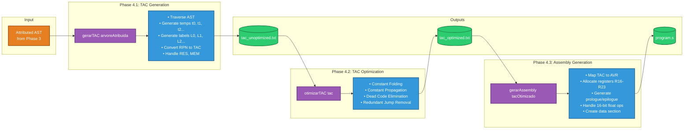
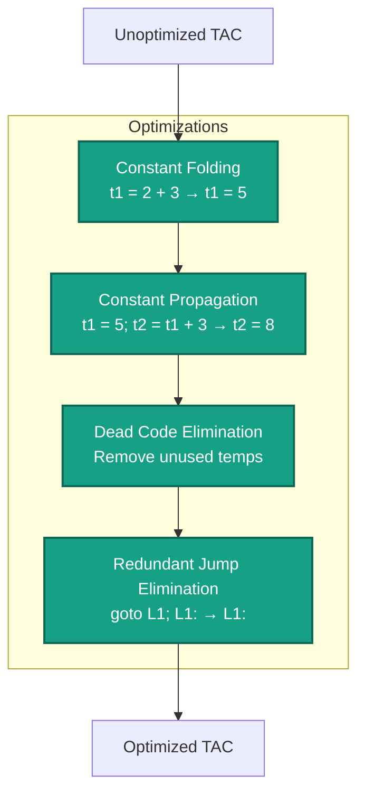
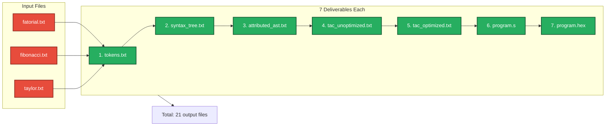

# Phase 4 Deliverables Flow Diagram

## Complete Compiler Pipeline with Deliverables

```mermaid
flowchart TD
    Start([Input File<br/>fatorial.txt, fibonacci.txt, taylor.txt])

    %% Phase 1
    P1[Phase 1: Lexical Analysis<br/>analisadorLexico]
    D1[(Deliverable 1:<br/>tokens.txt)]

    %% Phase 2
    P2[Phase 2: Syntax Analysis<br/>analisadorSintatico]
    D2[(Deliverable 2:<br/>syntax_tree.txt)]

    %% Phase 3
    P3[Phase 3: Semantic Analysis<br/>analisadorSemantico]
    D3[(Deliverable 3:<br/>attributed_ast.txt)]

    %% Phase 4.1
    P4_1[Phase 4.1: TAC Generation<br/>gerarTAC arvoreAtribuida]
    D4[(Deliverable 4:<br/>tac_unoptimized.txt)]

    %% Phase 4.2
    P4_2[Phase 4.2: TAC Optimization<br/>otimizarTAC tac]
    D5[(Deliverable 5:<br/>tac_optimized.txt)]

    %% Phase 4.3
    P4_3[Phase 4.3: Assembly Generation<br/>gerarAssembly tacOtimizado]
    D6[(Deliverable 6:<br/>program.s)]

    %% External Tools
    AVR[AVR Toolchain<br/>avr-gcc + avr-objcopy]
    D7[(Deliverable 7:<br/>program.hex)]

    Upload[Arduino Upload<br/>avrdude]
    Final([Running on Arduino Uno<br/>Serial/LED/LCD Output])

    %% Flow
    Start --> P1
    P1 --> D1
    D1 --> P2
    P2 --> D2
    D2 --> P3
    P3 --> D3
    D3 --> P4_1
    P4_1 --> D4
    D4 --> P4_2
    P4_2 --> D5
    D5 --> P4_3
    P4_3 --> D6
    D6 --> AVR
    AVR --> D7
    D7 --> Upload
    Upload --> Final

    %% Styling
    classDef phase fill:#4A90E2,stroke:#2E5C8A,stroke-width:2px,color:#fff
    classDef deliverable fill:#50C878,stroke:#2E7D4E,stroke-width:2px,color:#fff
    classDef external fill:#F39C12,stroke:#B8750A,stroke-width:2px,color:#fff
    classDef endpoint fill:#E74C3C,stroke:#A93226,stroke-width:2px,color:#fff

    class P1,P2,P3,P4_1,P4_2,P4_3 phase
    class D1,D2,D3,D4,D5,D6,D7 deliverable
    class AVR,Upload external
    class Start,Final endpoint
```

## Phase 4 Detailed Function Flow

## TAC Optimization Techniques Detail

## Test Files to Deliverables Mapping

## Usage

You can copy the Mermaid code blocks and paste them into:
- GitHub/GitLab markdown files (renders automatically)
- Mermaid Live Editor: https://mermaid.live
- VS Code with Mermaid extension
- Documentation tools that support Mermaid
