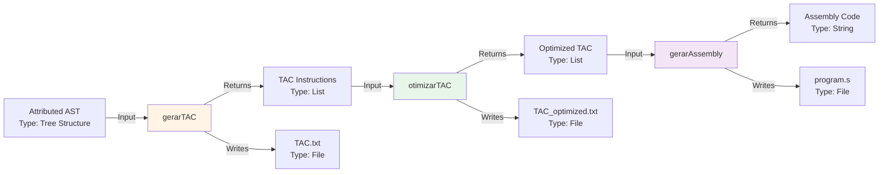
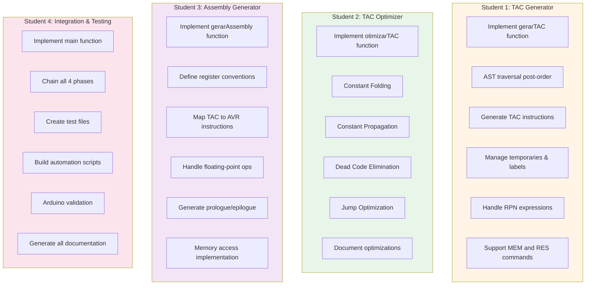
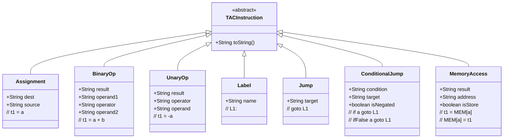

# Phase 4 Flowchart - Code Generation

## Complete Phase 4 Architecture

```mermaid
flowchart TB
    Start([Input: Source Code .txt file])

    subgraph Previous["Previous Phases (Already Implemented)"]
        Phase1[Phase 1: Lexical Analysis]
        Phase2[Phase 2: Syntax Analysis]
        Phase3[Phase 3: Semantic Analysis]

        Phase1 -->|Token Stream| Phase2
        Phase2 -->|Abstract Syntax Tree| Phase3
    end

    Start --> Phase1

    subgraph Phase4["Phase 4: Code Generation (NEW)"]
        direction TB

        Input[Input: Attributed AST<br/>from Phase 3]

        subgraph Student1["Student 1: TAC Generation"]
            direction TB
            GenTAC[Function: gerarTAC]
            TempVars[Manage Temporaries<br/>t0, t1, t2, ...]
            Labels[Manage Labels<br/>L0, L1, L2, ...]
            Traverse[Traverse AST<br/>Post-order]

            GenTAC --> Traverse
            Traverse --> TempVars
            Traverse --> Labels
        end

        subgraph Student2["Student 2: TAC Optimization"]
            direction TB
            OptTAC[Function: otimizarTAC]
            ConstFold[Constant Folding<br/>2 + 3 → 5]
            ConstProp[Constant Propagation<br/>t1=5; t2=t1+3 → t2=8]
            DeadCode[Dead Code Elimination<br/>Remove unused vars]
            JumpElim[Redundant Jump<br/>Elimination]

            OptTAC --> ConstFold
            OptTAC --> ConstProp
            OptTAC --> DeadCode OptTAC --> JumpElim end
        subgraph Student3["Student 3: Assembly Generation"]
            direction TB
            GenAsm[Function: gerarAssembly]
            RegAlloc[Register Allocation<br/>R16-R23 for temps]
            Mapping[TAC to AVR<br/>Instruction Mapping]
            FloatOps[Floating Point<br/>16-bit operations]

            GenAsm --> RegAlloc
            GenAsm --> Mapping
            GenAsm --> FloatOps
        end

        subgraph Student4["Student 4: Integration & Testing"]
            direction TB
            MainFunc[Function: main]
            Integration[Integrate All Phases<br/>1 → 2 → 3 → 4]
            Testing[Create Test Files<br/>fatorial.txt<br/>fibonacci.txt<br/>taylor.txt]
            Validation[Arduino Validation<br/>Compile & Upload]

            MainFunc --> Integration
            Integration --> Testing
            Testing --> Validation
        end

        Input --> GenTAC
        GenTAC -->|TAC Instructions| TACFile1[Output: TAC.txt]
        GenTAC -->|List of Instructions| OptTAC

        OptTAC -->|Optimized TAC| TACFile2[Output: TAC_optimized.txt]
        OptTAC -->|Optimized Instructions| GenAsm

        GenAsm -->|AVR Assembly Code| AsmFile[Output: program.s]
        GenAsm --> MainFunc
    end

    Phase3 -->|Attributed AST| Input

    subgraph Build["Build & Deploy Pipeline"]
        direction TB
        AsmFile --> Compile[avr-gcc compile]
        Compile -->|ELF binary| ObjCopy[avr-objcopy]
        ObjCopy -->|HEX file| HexFile[Output: program.hex]
        HexFile --> Upload[avrdude upload<br/>9600 baud]
        Upload --> Arduino[Arduino Uno<br/>Execution]
    end

    subgraph Deliverables["Final Deliverables"]
        direction LR
        D1[tokens.txt<br/>Phase 1]
        D2[syntax_tree.txt<br/>Phase 2]
        D3[attributed_ast.txt<br/>Phase 3]
        D4[TAC.txt<br/>Phase 4]
        D5[TAC_optimized.txt<br/>Phase 4]
        D6[program.s<br/>Assembly]
        D7[program.hex<br/>Executable]
        D8[README.md<br/>Documentation]
        D9[optimization_report.md<br/>Analysis]
    end

    Arduino --> Results[Validation Results<br/>Serial Output<br/>LED/LCD Display]

    style Phase4 fill:#e1f5ff
    style Student1 fill:#fff4e6
    style Student2 fill:#e8f5e9
    style Student3 fill:#f3e5f5
    style Student4 fill:#fce4ec
    style Build fill:#fff9c4
    style Deliverables fill:#f1f8e9
```

---

## Data Flow Between Functions



## Student Responsibilities Summary



## Execution Flow in main()

```mermaid
sequenceDiagram
    participant User
    participant Main as main()
    participant Lex as Lexical Analyzer
    participant Syn as Syntax Analyzer
    participant Sem as Semantic Analyzer
    participant TAC as gerarTAC()
    participant Opt as otimizarTAC()
    participant Asm as gerarAssembly()
    participant Build as Build System

    User->>Main: ./compilador fatorial.txt
    Main->>Lex: Analyze tokens
    Lex-->>Main: Token list
    Main->>Syn: Build syntax tree
    Syn-->>Main: AST
    Main->>Sem: Semantic analysis
    Sem-->>Main: Attributed AST

    rect rgb(255, 244, 230)
        Note over Main,TAC: Phase 4 starts here
        Main->>TAC: Generate TAC
        TAC-->>Main: TAC instructions + TAC.txt
    end

    rect rgb(232, 245, 233)
        Main->>Opt: Optimize TAC
        Opt-->>Main: Optimized TAC + TAC_optimized.txt
    end

    rect rgb(243, 229, 245)
        Main->>Asm: Generate Assembly
        Asm-->>Main: Assembly code + program.s
    end

    rect rgb(255, 249, 196)
        Main->>Build: Compile to HEX
        Build-->>Main: program.hex
    end

    Main-->>User: All files generated
    User->>Build: Upload to Arduino
    Build-->>User: Execution results
```

## TAC Instruction Types


