# RA2 Project Architecture Overview

## Complete System Architecture

The RA2 project implements a **four-phase sequential compiler system** that integrates lexical analysis (RA1) with syntactic analysis (RA2). The system processes mathematical expressions and control structures using an LL(1) grammar-based parser with dual token processing paths.

### System Architecture Overview

```mermaid
%%{init: {'theme':'base', 'themeVariables': { 'primaryColor': '#ffffff', 'primaryTextColor': '#000000', 'primaryBorderColor': '#333333', 'lineColor': '#333333', 'secondaryColor': '#f8f9fa', 'tertiaryColor': '#e9ecef'}}}%%
graph TD
    %% Input Layer
    subgraph "Input Layer"
        A1["📄 Input Files<br/>teste1.txt, teste2.txt, teste3.txt"]
        A2["⚡ Command Line<br/>AnalisadorSintatico.py file.txt"]
    end

    %% Phase 1: RA1 Processing
    subgraph "Phase 1: RA1 Processing (Lines 70-128)"
        direction TB
        B1["📖 lerArquivo()<br/>Read source file"]
        B2["✅ exibirResultados()<br/>Validate & process expressions<br/>Generate tokens_gerados.txt"]
        B3["📖 lerArquivo()<br/>Read tokens for assembly"]
        B4["⚙️ gerarAssemblyMultiple()<br/>Generate Arduino assembly"]
        B5["💾 save_assembly()<br/>Save programa_completo.S"]
        B6["💾 save_registers_inc()<br/>Save registers.inc"]
    end

    %% Phase 2: RA2 Validation
    subgraph "Phase 2: RA2 Validation (Lines 137-145)"
        direction TB
        C1["📝 lerTokens()<br/>VALIDATION ONLY<br/>Read & enhance tokens"]
        C2["✅ validarTokens()<br/>Check parentheses balance"]
    end

    %% Phase 3: Grammar Setup
    subgraph "Phase 3: Grammar Setup (Lines 150-166)"
        direction TB
        D1["📚 imprimir_gramatica_completa()<br/>Display grammar & sets"]
        D2["📋 construirTabelaLL1()<br/>Build LL(1) parsing table"]
    end

    %% Phase 4: Parsing Process
    subgraph "Phase 4: Parsing Process (Lines 174-237)"
        direction TB
        E1["📖 lerArquivo()<br/>SECOND read for parsing"]
        E2["🔄 segmentar_linha_em_instrucoes()<br/>Segment instructions"]
        E3["🔍 reconhecerToken()<br/>Direct token recognition"]
        E4["🔍 parsear_todas_linhas()<br/>Parse & generate derivations"]
        E5["🌳 gerar_e_salvar_todas_arvores()<br/>Generate syntax trees"]
        E6["📝 atualizar_documentacao_gramatica()<br/>Update grammar documentation"]
    end

    %% Output Layer
    subgraph "Output Layer"
        F1["🌳 arvore_output.txt<br/>Syntax Trees"]
        F2["⚙️ programa_completo.S<br/>Assembly Code"]
        F3["💾 registers.inc<br/>Assembly Headers"]
        F4["📋 tokens_gerados.txt<br/>Token Files"]
        F5["📖 Console Output<br/>Grammar Documentation"]
        F6["📝 grammar_documentation.md<br/>Auto-Updated Grammar Reference"]
    end

    %% Sequential flow
    A1 --> B1
    A2 --> B1
    B1 --> B2
    B2 --> B3
    B3 --> B4
    B4 --> B5
    B4 --> B6

    B2 --> C1
    C1 --> C2
    C2 --> D1
    D1 --> D2

    D2 --> E1
    E1 --> E2
    E2 --> E3
    E3 --> E4
    E4 --> E5
    E5 --> E6

    %% Output connections
    E5 --> F1
    E6 --> F6
    B5 --> F2
    B6 --> F3
    B2 --> F4
    D1 --> F5

    %% Styling
    classDef inputStyle fill:#e3f2fd,stroke:#1976d2,stroke-width:2px
    classDef ra1Style fill:#f1f8e9,stroke:#388e3c,stroke-width:2px
    classDef validationStyle fill:#fff3e0,stroke:#ff9800,stroke-width:2px
    classDef grammarStyle fill:#f3e5f5,stroke:#9c27b0,stroke-width:2px
    classDef parseStyle fill:#fce4ec,stroke:#e91e63,stroke-width:2px
    classDef outputStyle fill:#e8f5e8,stroke:#4caf50,stroke-width:2px

    class A1,A2 inputStyle
    class B1,B2,B3,B4,B5,B6 ra1Style
    class C1,C2 validationStyle
    class D1,D2 grammarStyle
    class E1,E2,E3,E4,E5,E6 parseStyle
    class F1,F2,F3,F4,F5,F6 outputStyle
```

## Detailed Four-Phase Processing Flow

### Phase 1: RA1 - Lexical Analysis & Assembly Generation

```mermaid
%%{init: {'theme':'base', 'themeVariables': { 'primaryColor': '#ffffff', 'primaryTextColor': '#000000', 'primaryBorderColor': '#333333', 'lineColor': '#333333', 'secondaryColor': '#f8f9fa', 'tertiaryColor': '#e9ecef'}}}%%
flowchart TB
    subgraph "RA1 Processing Pipeline (Lines 70-128)"
        A["📄 Input File<br/>Mathematical Expressions"]
        B["📖 lerArquivo()<br/>• Read file lines<br/>• Filter comments<br/>• Return string list"]
        C["✅ exibirResultados()<br/>• Validate expressions (validarExpressao)<br/>• Parse tokens (parseExpressao)<br/>• Execute calculations (executarExpressao)<br/>• Generate tokens_gerados.txt"]
        D["📖 lerArquivo(tokens_gerados.txt)<br/>• Read generated tokens<br/>• Prepare for assembly"]
        E["⚙️ gerarAssemblyMultiple()<br/>• Generate Arduino assembly<br/>• Multi-operation support"]
        F["💾 save_assembly()<br/>• Save programa_completo.S"]
        G["💾 save_registers_inc()<br/>• Save registers.inc"]

        A --> B
        B --> C
        C --> D
        D --> E
        E --> F
        E --> G
    end

    classDef inputNode fill:#e3f2fd,stroke:#2196f3,stroke-width:2px
    classDef processNode fill:#f1f8e9,stroke:#388e3c,stroke-width:2px
    classDef outputNode fill:#e8f5e8,stroke:#4caf50,stroke-width:2px

    class A inputNode
    class B,C,D,E processNode
    class F,G outputNode
```

### Phase 2: RA2 - Token Validation (Standalone)

```mermaid
%%{init: {'theme':'base', 'themeVariables': { 'primaryColor': '#ffffff', 'primaryTextColor': '#000000', 'primaryBorderColor': '#333333', 'lineColor': '#333333', 'secondaryColor': '#f8f9fa', 'tertiaryColor': '#e9ecef'}}}%%
flowchart TB
    subgraph "RA2 Validation Pipeline (Lines 137-145)"
        A["📝 lerTokens(tokens_gerados.txt)<br/>• VALIDATION ONLY<br/>• Read RA1 tokens<br/>• Add control structure tokens<br/>• NOT used in parsing"]
        B["✅ validarTokens()<br/>• Check parentheses balance<br/>• Validate token sequence<br/>• Return bool success"]

        A --> B
    end

    classDef validationNode fill:#fff3e0,stroke:#ff9800,stroke-width:2px

    class A,B validationNode
```

### Phase 3: Grammar Setup & LL(1) Table Construction

```mermaid
%%{init: {'theme':'base', 'themeVariables': { 'primaryColor': '#ffffff', 'primaryTextColor': '#000000', 'primaryBorderColor': '#333333', 'lineColor': '#333333', 'secondaryColor': '#f8f9fa', 'tertiaryColor': '#e9ecef'}}}%%
flowchart TB
    subgraph "Grammar Setup Pipeline (Lines 150-166)"
        A["📚 imprimir_gramatica_completa()<br/>• Display LL(1) grammar rules<br/>• Calculate & show FIRST sets<br/>• Calculate & show FOLLOW sets<br/>• Display parsing table"]
        B["📋 construirTabelaLL1()<br/>• Build LL(1) parsing table<br/>• Detect FIRST/FIRST conflicts<br/>• Detect FIRST/FOLLOW conflicts<br/>• Return parsing table"]

        A --> B
    end

    classDef grammarNode fill:#f3e5f5,stroke:#9c27b0,stroke-width:2px

    class A,B grammarNode
```

### Phase 4: Parsing Process & Tree Generation

```mermaid
%%{init: {'theme':'base', 'themeVariables': { 'primaryColor': '#ffffff', 'primaryTextColor': '#000000', 'primaryBorderColor': '#333333', 'lineColor': '#333333', 'secondaryColor': '#f8f9fa', 'tertiaryColor': '#e9ecef'}}}%%
flowchart TB
    subgraph "Parsing Pipeline (Lines 174-237)"
        A["📖 lerArquivo(tokens_gerados.txt)<br/>• SECOND file read<br/>• Different from validation<br/>• For actual parsing"]
        B["🔄 segmentar_linha_em_instrucoes()<br/>• Segment by balanced parentheses<br/>• Extract individual instructions<br/>• Handle complex expressions"]
        C["🔍 reconhecerToken()<br/>• DIRECT token recognition<br/>• Not through lerTokens!<br/>• Build tokens_por_linha"]
        D["🔍 parsear_todas_linhas()<br/>• Stack-based LL(1) parsing<br/>• Use parsing table<br/>• Generate derivation steps"]
        E["🌳 gerar_e_salvar_todas_arvores()<br/>• Convert derivations to trees<br/>• ASCII visualization<br/>• Save arvore_output.txt"]
        F["📝 atualizar_documentacao_gramatica()<br/>• Extract latest syntax tree<br/>• Update grammar_documentation.md<br/>• Add timestamp"]

        A --> B
        B --> C
        C --> D
        D --> E
        E --> F
    end

    classDef parseNode fill:#fce4ec,stroke:#e91e63,stroke-width:2px

    class A,B,C,D,E,F parseNode
```

## Integration Between RA1 and RA2

### Data Flow Integration

The system implements a sophisticated **dual-path token processing architecture** with these key characteristics:

1. **Shared Token File - Dual Processing Paths**:
   - RA1 generates tokens in `tokens_gerados.txt` (via `exibirResultados()`)
   - **Path 1 (Validation)**: RA2's `lerTokens()` reads for validation only (Phase 2)
   - **Path 2 (Parsing)**: Separate `lerArquivo()` + `reconhecerToken()` for actual parsing (Phase 4)
   - **Critical**: These are completely independent token processing paths

2. **File Read Twice Pattern**:
   - **First Read**: Line 96 - `lerArquivo(OUT_TOKENS)` for assembly generation
   - **Second Read**: Line 174 - `lerArquivo(OUT_TOKENS)` for parsing process
   - Each read serves a different purpose in the architecture

3. **Sequential Phase Dependencies**:
   - **Phase 1 (RA1)** must complete successfully before any RA2 processing
   - **Phase 2 (Validation)** is standalone - results not used in parsing
   - **Phase 3 (Grammar)** builds LL(1) table for parsing
   - **Phase 4 (Parsing)** uses grammar table + separate token processing

4. **Error Propagation Strategy**:
   - RA1 errors terminate entire process (fail-fast approach)
   - Each RA2 phase has independent error handling
   - Validation errors don't prevent grammar setup
   - Grammar errors don't prevent parsing attempts

### Critical Architecture Insights

- **Dual Token Processing**: Validation vs. Parsing use completely different token paths
- **File Read Multiplicity**: `tokens_gerados.txt` is read multiple times for different purposes
- **Sequential Not Parallel**: Each phase must complete before the next begins
- **Validation ≠ Parsing**: RA2 validation is completely separate from actual parsing
- **Function Call Accuracy**: Actual functions differ from internal implementation details

### Architecture Benefits

- **Robust Validation**: Independent validation ensures token quality before processing
- **Flexible Processing**: Multiple token processing paths for different needs
- **Error Isolation**: Phase-specific error handling prevents cascade failures
- **Output Diversity**: Assembly code, syntax trees, and documentation all from one source
- **Modular Design**: Each phase can be tested and maintained independently

## System Execution Flow

## Error Handling Architecture

The system implements comprehensive error handling across all four phases:

### Phase-Specific Error Categories

#### Phase 1: RA1 Processing Errors
- **File Errors**: Missing input files, permission issues, path resolution failures
- **Expression Errors**: Invalid syntax, unbalanced parentheses, malformed expressions
- **Mathematical Errors**: Division by zero, invalid operations, calculation failures
- **Assembly Errors**: File writing failures, assembly generation issues

#### Phase 2: RA2 Validation Errors
- **Token Reading Errors**: File access issues, malformed token files
- **Token Format Errors**: Invalid token structures, unrecognized token types
- **Validation Errors**: Parentheses imbalance, sequence validation failures
- **Enhancement Errors**: Control token addition failures

#### Phase 3: Grammar Setup Errors
- **Grammar Definition Errors**: Invalid production rules, malformed grammar
- **FIRST/FOLLOW Calculation Errors**: Set computation failures, recursive dependencies
- **LL(1) Table Errors**: Conflicts (FIRST/FIRST, FIRST/FOLLOW), table construction failures
- **Display Errors**: Console output issues, formatting problems

#### Phase 4: Parsing Process Errors
- **File Reading Errors**: Token file access issues (second read)
- **Segmentation Errors**: Instruction parsing failures, unbalanced parentheses
- **Token Recognition Errors**: Invalid token elements, recognition failures
- **Parsing Errors**: Syntax violations, unexpected tokens, derivation failures
- **Tree Generation Errors**: Tree construction issues, file writing failures

### Error Recovery Strategy

- **Phase-Isolated Recovery**: Each phase has independent error handling
- **Fail-Fast for Critical Errors**: RA1 errors terminate entire process
- **Continue-on-Warning**: Non-critical errors allow process continuation
- **Detailed Error Reporting**: Line number references, specific error contexts
- **User-Friendly Messages**: Clear explanations with debugging guidance
- **Graceful Degradation**: Process as much as possible before failure

### Error Propagation Flow

1. **RA1 Errors**: Immediate termination with detailed reporting
2. **Validation Errors**: Log but continue to grammar setup
3. **Grammar Errors**: Attempt parsing with incomplete information
4. **Parsing Errors**: Generate partial results where possible

This multi-layered approach ensures robust error handling while maintaining system usability and debugging capabilities.
