# RA2 Function Interface Specifications

## Complete Function Call Hierarchy

This document provides detailed specifications for all functions in the RA2 system, including parameters, return values, and their interconnections.

### Main Entry Point Function

```mermaid
%%{init: {'theme':'base', 'themeVariables': { 'primaryColor': '#ffffff', 'primaryTextColor': '#000000', 'primaryBorderColor': '#333333', 'lineColor': '#333333', 'secondaryColor': '#f8f9fa', 'tertiaryColor': '#e9ecef'}}}%%
flowchart TD
    %% Phase 1: Input and RA1 Processing
    subgraph "Phase 1: RA1 Processing (Lines 70-128)"
        direction TB
        A["🎯 main()<br/>• File path resolution<br/>• Error handling"]
        B1["📖 lerArquivo(input_file)<br/>Return: List[str]<br/>• Read source file<br/>• Filter comments"]
        B2["✅ exibirResultados(operacoes, OUT_TOKENS)<br/>Return: Tuple[bool, int, int]<br/>• Validate & process expressions<br/>• Generate tokens_gerados.txt"]
        B3["📖 lerArquivo(OUT_TOKENS)<br/>Return: List[str]<br/>• Read generated tokens<br/>• For assembly generation"]
        B4["⚙️ gerarAssemblyMultiple(all_tokens, codigo)<br/>Return: None<br/>• Generate Arduino assembly"]
        B5["💾 save_assembly(codigo, file_path)<br/>Return: None<br/>• Save programa_completo.S"]
        B6["💾 save_registers_inc(file_path)<br/>Return: None<br/>• Save registers.inc"]
    end

    %% Phase 2: RA2 Validation
    subgraph "Phase 2: RA2 Token Validation (Lines 137-145)"
        direction TB
        C1["📝 lerTokens(OUT_TOKENS)<br/>Return: List[Token]<br/>• VALIDATION ONLY<br/>• Add control tokens"]
        C1a["✅ validarTokens(tokens)<br/>Return: bool<br/>• Check parentheses balance<br/>• Validate sequence"]
    end

    %% Phase 3: Grammar Setup
    subgraph "Phase 3: Grammar Setup (Lines 150-166)"
        direction TB
        C2["📚 imprimir_gramatica_completa()<br/>Return: None<br/>• Display grammar rules<br/>• Show FIRST/FOLLOW sets"]
        C3["📋 construirTabelaLL1()<br/>Return: Dict[str, Dict[str, List[str]]]<br/>• Build LL(1) parsing table<br/>• Detect conflicts"]
    end

    %% Phase 4: Parsing Process
    subgraph "Phase 4: Parsing Process (Lines 174-237)"
        direction TB
        D1["📖 lerArquivo(OUT_TOKENS)<br/>Return: List[str]<br/>• SECOND read for parsing<br/>• Different from validation"]
        D2["🔄 segmentar_linha_em_instrucoes(linha)<br/>Return: List[str]<br/>• Segment balanced parentheses<br/>• Extract instructions"]
        D3["🔍 reconhecerToken(elemento, 1, 1)<br/>Return: Optional[Token]<br/>• Direct token recognition<br/>• Build tokens_por_linha"]
        D4["🔍 parsear_todas_linhas(tabela_ll1, tokens_por_linha)<br/>Return: List[List[str]]<br/>• Parse all token lines<br/>• Generate derivations"]
        D5["🌳 gerar_e_salvar_todas_arvores(derivacoes, arquivo)<br/>Return: bool<br/>• Generate syntax trees<br/>• Save arvore_output.txt"]
        D6["📝 atualizar_documentacao_gramatica()<br/>Return: None<br/>• Update grammar_documentation.md<br/>• Extract latest syntax tree<br/>• Add timestamp"]
    end

    %% Sequential flow
    A --> B1
    B1 --> B2
    B2 --> B3
    B3 --> B4
    B4 --> B5
    B4 --> B6

    B2 --> C1
    C1 --> C1a
    C1a --> C2
    C2 --> C3

    C3 --> D1
    D1 --> D2
    D2 --> D3
    D3 --> D4
    D4 --> D5
    D5 --> D6

    %% Data flow (corrected)
    B1 -.->|"source_content"| B2
    B2 -.->|"tokens_gerados.txt"| B3
    B2 -.->|"tokens_gerados.txt"| C1
    B3 -.->|"token_strings"| B4
    C3 -.->|"ll1_table"| D4
    D1 -.->|"token_lines"| D2
    D2 -.->|"instructions"| D3
    D3 -.->|"tokens_por_linha"| D4
    D4 -.->|"derivations"| D5

    classDef mainFunc fill:#e8f5e8,stroke:#4caf50,stroke-width:3px
    classDef ra1Func fill:#f1f8e9,stroke:#388e3c,stroke-width:2px
    classDef validationFunc fill:#fff3e0,stroke:#ff9800,stroke-width:2px
    classDef grammarFunc fill:#f3e5f5,stroke:#9c27b0,stroke-width:2px
    classDef parseFunc fill:#fce4ec,stroke:#e91e63,stroke-width:2px

    class A mainFunc
    class B1,B2,B3,B4,B5,B6 ra1Func
    class C1,C1a validationFunc
    class C2,C3 grammarFunc
    class D1,D2,D3,D4,D5,D6 parseFunc
```

## Detailed RA2 Function Interfaces

### Token Processing Functions

```mermaid
%%{init: {'theme':'base', 'themeVariables': { 'primaryColor': '#ffffff', 'primaryTextColor': '#000000', 'primaryBorderColor': '#333333', 'lineColor': '#333333', 'secondaryColor': '#f8f9fa', 'tertiaryColor': '#e9ecef'}}}%%
graph LR
    subgraph "lerTokens.py Module"
        direction TB
        A["📝 lerTokens(arquivo: str)<br/>Parameters:<br/>• arquivo: str - Path to token file<br/>Return: List[Token]<br/>Functionality:<br/>• Read RA1 generated tokens<br/>• Process line by line<br/>• Add EOF token"]

        B["🔤 processarLinha(linha: str, linha_num: int)<br/>Parameters:<br/>• linha: Token string<br/>• linha_num: Line number<br/>Return: List[Token]<br/>Functionality:<br/>• Character-by-character parsing<br/>• Handle parentheses separately<br/>• Extract complete elements"]

        C["🔍 reconhecerToken(elemento: str, linha: int, coluna: int)<br/>Parameters:<br/>• elemento: Token string<br/>• linha: Line position<br/>• coluna: Column position<br/>Return: Optional[Token]<br/>Functionality:<br/>• Identify token types<br/>• Support control structures<br/>• Handle operators"]

        D["✅ validarTokens(tokens: List[Token])<br/>Parameters:<br/>• tokens: Token list<br/>Return: bool<br/>Functionality:<br/>• Check parentheses balance<br/>• Validate token sequence"]

        A --> B
        B --> C
        A --> D
    end

    classDef publicFunc fill:#e3f2fd,stroke:#2196f3,stroke-width:2px
    classDef privateFunc fill:#f3e5f5,stroke:#9c27b0,stroke-width:1px

    class A,D publicFunc
    class B,C privateFunc
```

### Grammar Processing Functions

```mermaid
%%{init: {'theme':'base', 'themeVariables': { 'primaryColor': '#ffffff', 'primaryTextColor': '#000000', 'primaryBorderColor': '#333333', 'lineColor': '#333333', 'secondaryColor': '#f8f9fa', 'tertiaryColor': '#e9ecef'}}}%%
graph TB
    subgraph "Grammar Processing Module Chain"
        direction TB

        subgraph "configuracaoGramatica.py"
            A["🗃️ GRAMATICA_RPN: Dict[str, List[List[str]]]<br/>• LL(1) production rules<br/>• Non-terminal definitions<br/>• Control structure support"]

            B["🔄 mapear_gramatica_para_tokens_reais(gramatica_teorica: Dict)<br/>Parameters: Grammar with theoretical tokens<br/>Return: Dict with real tokens<br/>• Convert theoretical to real tokens"]

            C["🔄 mapear_tokens_reais_para_teoricos(conjunto_ou_dict)<br/>Parameters: Real tokens/sets/dicts<br/>Return: Theoretical equivalents<br/>• Reverse token mapping"]
        end

        subgraph "calcularFirst.py"
            D["🧮 calcularFirst()<br/>Parameters: None<br/>Return: Dict[str, Set[str]]<br/>• Compute FIRST sets<br/>• Handle EPSILON productions<br/>• Fixed-point algorithm"]

            E["🧮 calcular_first_da_sequencia(sequencia: List[str], FIRST: Dict, nao_terminais: Set)<br/>Parameters: Symbol sequence, FIRST sets, non-terminals<br/>Return: Set[str]<br/>• FIRST of symbol sequence<br/>• Used in LL(1) table construction"]
        end

        subgraph "calcularFollow.py"
            F["🧮 calcularFollow()<br/>Parameters: None<br/>Return: Dict[str, Set[str]]<br/>• Compute FOLLOW sets<br/>• Use FIRST results<br/>• Fixed-point algorithm"]
        end

        subgraph "construirTabelaLL1.py"
            G["📋 construirTabelaLL1()<br/>Parameters: None<br/>Return: Dict[str, Dict[str, List[str]]]<br/>• Build LL(1) parsing table<br/>• Detect FIRST/FIRST conflicts<br/>• Detect FIRST/FOLLOW conflicts<br/>• Raise ConflictError on issues"]
        end
    end

    A --> B
    A --> C
    A --> D
    D --> E
    D --> F
    F --> G
    E --> G

    classDef dataStruct fill:#fff3e0,stroke:#ff9800,stroke-width:2px
    classDef computeFunc fill:#f3e5f5,stroke:#9c27b0,stroke-width:2px
    classDef mapFunc fill:#e8f5e8,stroke:#4caf50,stroke-width:2px

    class A dataStruct
    class D,E,F,G computeFunc
    class B,C mapFunc
```

### Parsing and Tree Generation Functions

```mermaid
%%{init: {'theme':'base', 'themeVariables': { 'primaryColor': '#ffffff', 'primaryTextColor': '#000000', 'primaryBorderColor': '#333333', 'lineColor': '#333333', 'secondaryColor': '#f8f9fa', 'tertiaryColor': '#e9ecef'}}}%%
graph LR
    subgraph "Parsing Module - parsear.py"
        direction TB
        A["🔍 parsear(tabela_ll1: Dict, tokens_linha: List[Token])<br/>Parameters:<br/>• tabela_ll1: LL(1) parsing table<br/>• tokens_linha: Token sequence<br/>Return: List[str] - Derivation steps<br/>Functionality:<br/>• Stack-based LL(1) parsing<br/>• Generate derivation sequence<br/>• Map tokens to grammar symbols"]

        B["🔍 parsear_todas_linhas(tabela_ll1: Dict, tokens_por_linha: List[List[Token]])<br/>Parameters:<br/>• tabela_ll1: LL(1) table<br/>• tokens_por_linha: Multiple token sequences<br/>Return: List[List[str]] - All derivations<br/>Functionality:<br/>• Process multiple lines<br/>• Handle syntax errors<br/>• Maintain line indexing"]
    end

    subgraph "Tree Generation - gerarArvore.py"
        direction TB
        C["🌳 NoArvore<br/>Attributes:<br/>• label: str<br/>• filhos: List[NoArvore]<br/>Methods:<br/>• adicionar_filho(filho)<br/>• desenhar_ascii(prefixo, eh_ultimo)"]

        D["🌳 gerarArvore(derivacao: List[str])<br/>Parameters:<br/>• derivacao: Derivation steps<br/>Return: NoArvore - Root node<br/>Functionality:<br/>• Convert derivation to tree<br/>• Recursive tree construction<br/>• Handle epsilon productions"]

        E["📁 exportar_arvore_ascii(arvore: NoArvore, nome_arquivo: str)<br/>Parameters:<br/>• arvore: Tree root<br/>• nome_arquivo: Output filename<br/>Return: None<br/>Functionality:<br/>• Generate ASCII representation<br/>• Save to file and outputs/RA2/"]

        F["📁 gerar_e_salvar_todas_arvores(derivacoes_por_linha: List[List[str]], nome_arquivo: str)<br/>Parameters:<br/>• derivacoes_por_linha: All derivations<br/>• nome_arquivo: Output filename<br/>Return: bool - Success status<br/>Functionality:<br/>• Process all derivations<br/>• Generate comprehensive output<br/>• Handle errors gracefully"]

        G["📝 atualizar_documentacao_gramatica()<br/>Parameters: None<br/>Return: None<br/>Functionality:<br/>• Update grammar_documentation.md<br/>• Extract latest syntax tree<br/>• Add timestamp to documentation"]
    end

    A --> B
    D --> C
    D --> E
    F --> D
    F --> G
    B -.->|"derivations"| F

    classDef parseFunc fill:#fce4ec,stroke:#e91e63,stroke-width:2px
    classDef treeFunc fill:#e8f5e8,stroke:#4caf50,stroke-width:2px
    classDef dataClass fill:#fff3e0,stroke:#ff9800,stroke-width:2px
    classDef docFunc fill:#f1f8e9,stroke:#388e3c,stroke-width:2px

    class A,B parseFunc
    class D,E,F treeFunc
    class C dataClass
    class G docFunc
```

## Data Structure Specifications

### Core Data Types

## Function Parameter and Return Value Details

### Complete Function Signatures

| Module | Function | Parameters | Return Type | Actual Purpose (Based on Code Analysis) |
|--------|----------|------------|-------------|---------|
| **AnalisadorSintatico.py** | `main` | `sys.argv[1]: str` | `None` | Main orchestration with 4 sequential phases |
| | `segmentar_linha_em_instrucoes` | `linha_texto: str` | `List[str]` | Segment line by balanced parentheses (line 176) |
| **RA1 Functions** | `lerArquivo` | `nomeArquivo: str` | `List[str]` | Read file lines, filter empty/comments (called 2x) |
| | `exibirResultados` | `vetor_linhas: List[str], out_tokens: Path` | `Tuple[bool, int, int]` | Validate, tokenize, evaluate expressions (line 82) |
| | `gerarAssemblyMultiple` | `all_tokens: List[List[str]], codigo_assembly: List[str]` | `None` | Generate Arduino assembly code (line 111) |
| | `save_assembly` | `codigo_assembly: List[str], file_path: str` | `None` | Save programa_completo.S file (line 117) |
| | `save_registers_inc` | `file_path: str` | `None` | Save registers.inc file (line 99) |
| **lerTokens.py** | `lerTokens` | `arquivo: str` | `List[Token]` | **VALIDATION ONLY** - not used in parsing (line 137) |
| | `validarTokens` | `tokens: List[Token]` | `bool` | Validate parentheses balance (line 138) |
| | `reconhecerToken` | `elemento: str, linha: int, coluna: int` | `Optional[Token]` | **MAIN PARSING** - direct token recognition (line 223) |
| | `processarLinha` | `linha: str, linha_num: int` | `List[Token]` | Internal helper for lerTokens |
| **calcularFirst.py** | `calcularFirst` | None | `Dict[str, Set[str]]` | Compute FIRST sets for LL(1) grammar |
| | `calcular_first_da_sequencia` | `sequencia: List[str], FIRST: Dict, nao_terminais: Set` | `Set[str]` | FIRST of symbol sequence |
| **calcularFollow.py** | `calcularFollow` | None | `Dict[str, Set[str]]` | Compute FOLLOW sets for LL(1) grammar |
| **construirTabelaLL1.py** | `construirTabelaLL1` | None | `Dict[str, Dict[str, List[str]]]` | Build LL(1) parsing table (line 160) |
| **construirGramatica.py** | `imprimir_gramatica_completa` | None | `None` | Display grammar, FIRST/FOLLOW, LL(1) table (line 150) |
| **parsear.py** | `parsear` | `tabela_ll1: Dict, tokens_linha: List[Token]` | `List[str]` | Parse single token sequence |
| | `parsear_todas_linhas` | `tabela_ll1: Dict, tokens_por_linha: List[List[Token]]` | `List[List[str]]` | Parse all lines, generate derivations (line 233) |
| **gerarArvore.py** | `gerarArvore` | `derivacao: List[str]` | `NoArvore` | Generate syntax tree from derivation |
| | `exportar_arvore_ascii` | `arvore: NoArvore, nome_arquivo: str` | `None` | Export single tree to ASCII file |
| | `gerar_e_salvar_todas_arvores` | `derivacoes_por_linha: List[List[str]], nome_arquivo: str` | `bool` | Export all trees to arvore_output.txt (line 237) |
| **AnalisadorSintatico.py** | `atualizar_documentacao_gramatica` | None | `None` | Update grammar_documentation.md with latest syntax tree (line 331) |

## Error Handling Specifications

### Exception Types and Handling

```mermaid
%%{init: {'theme':'base', 'themeVariables': { 'primaryColor': '#ffffff', 'primaryTextColor': '#000000', 'primaryBorderColor': '#333333', 'lineColor': '#333333', 'secondaryColor': '#f8f9fa', 'tertiaryColor': '#e9ecef'}}}%%
flowchart TB
    subgraph "Exception Hierarchy"
        A["💥 Standard Exceptions"]
        B["📄 FileNotFoundError<br/>• Missing token files<br/>• Invalid file paths"]
        C["⚠️ ValueError<br/>• Invalid token formats<br/>• Malformed expressions"]
        D["🔧 ConflictError<br/>• LL(1) grammar conflicts<br/>• FIRST/FIRST conflicts<br/>• FIRST/FOLLOW conflicts"]
        E["🌳 TreeConstructionError<br/>• Invalid derivations<br/>• Malformed syntax trees"]

        A --> B
        A --> C
        D --> A
        E --> A
    end

    subgraph "Error Recovery Strategies"
        F["🔄 Error Recovery"]
        G["⏭️ Continue Processing<br/>• Skip invalid lines<br/>• Process remaining input"]
        H["🛑 Fail Fast<br/>• Stop on critical errors<br/>• Prevent cascade failures"]
        I["📝 Detailed Logging<br/>• Line number reporting<br/>• Context information"]

        F --> G
        F --> H
        F --> I
    end

    B --> F
    C --> F
    D --> H
    E --> G

    classDef errorType fill:#ffebee,stroke:#f44336,stroke-width:2px
    classDef recovery fill:#e8f5e8,stroke:#4caf50,stroke-width:2px

    class A,B,C,D,E errorType
    class F,G,H,I recovery
```

## Function Call Dependencies and Data Flow

The complete function call chain follows this **4-phase sequential pattern** (corrected based on actual code analysis):

### **Phase 1: RA1 Processing (Lines 70-128)**
1. **File Reading**: `main()` → `lerArquivo(input_file)`
2. **Expression Processing**: `exibirResultados(lines, OUT_TOKENS)`
3. **Assembly Generation**: `lerArquivo(OUT_TOKENS)` → `gerarAssemblyMultiple()` → `save_assembly()` + `save_registers_inc()`

### **Phase 2: RA2 Token Validation (Lines 137-145)**
4. **Validation Only**: `lerTokens(OUT_TOKENS)` → `validarTokens()` (**NOT used in parsing!**)

### **Phase 3: Grammar Setup (Lines 150-166)**
5. **Grammar Display**: `imprimir_gramatica_completa()` (includes `calcularFirst()` + `calcularFollow()`)
6. **Table Construction**: `construirTabelaLL1()`

### **Phase 4: Parsing Process (Lines 174-237)**
7. **Separate Token Processing**: `lerArquivo(OUT_TOKENS)` → `segmentar_linha_em_instrucoes()` → `reconhecerToken()` (**Direct, not through lerTokens!**)
8. **Parsing**: `parsear_todas_linhas(tabela_ll1, tokens_por_linha)`
9. **Tree Generation**: `gerar_e_salvar_todas_arvores(derivations)`

## **Critical Architecture Insights**

- **Two Separate Token Paths**: `lerTokens()` for validation vs. `reconhecerToken()` for parsing
- **File Read Twice**: `lerArquivo(OUT_TOKENS)` called in both Phase 1 and Phase 4
- **Sequential Not Parallel**: Each phase must complete before the next begins
- **Validation ≠ Parsing**: RA2 validation is separate from actual parsing

This corrected architecture reveals a sophisticated dual-path design that ensures both validation and parsing accuracy.